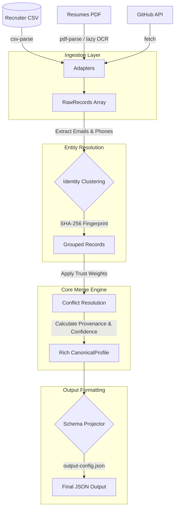

# Multi-Source Profiler

A production-quality CLI tool that transforms messy, multi-source candidate data into trustworthy canonical candidate profiles. It merges structured (CSV) and unstructured (GitHub, PDF) data with deterministic conflict resolution, tracks the provenance of every field, and supports runtime schema projection.

## Installation & Setup

1. **Install dependencies:**
   ```bash
   npm install
   ```
2. **Build the project (Required for CLI execution):**
   ```bash
   npm run build
   ```

## Running the Pipeline

### 1. Default Schema Run
Run the pipeline with the provided sample CSV and Resume PDF:
```bash
npx ts-node src/cli.ts --csv sample-inputs/candidates.csv --resume sample-inputs/resume.pdf --pretty
```

The sample CSV contains two distinct candidates, so this command emits an array of canonical profiles. The resume is matched into Jane Doe's profile by normalized email/phone evidence instead of being blindly merged into every CSV row.

### 2. Custom Config Run
Run the pipeline with a custom projection configuration (e.g. mapping fields, toggling confidence):
```bash
npx ts-node src/cli.ts --csv sample-inputs/candidates.csv --config sample-inputs/output-config.json --pretty
```

### 3. Run the Web UI (Optional)
The project includes a full graphical interface to upload PDFs and CSVs:
```bash
npm install --prefix frontend
npm run start:ui
```
This concurrently starts the Express API and the Vite frontend. Open the Local URL provided in the terminal (usually `http://localhost:5173`).

### 4. Run Tests
Execute the robust test suite to verify all core logic:
```bash
npm test
```

## Pipeline Architecture



## Submission Artifacts

- Design document: `SoveetPrusty_soveet.prusty@gmail.com_Eightfold.pdf`
- Default output: `sample-outputs/default-output.json`
- Custom-config output: `sample-outputs/custom-output.json`

## Optional GitHub Source

```bash
npx ts-node src/cli.ts --github octocat --pretty
```

GitHub is treated as its own candidate unless it shares a normalized contact key with another source. This avoids polluting a CSV/resume candidate with an unrelated public profile.

## Architecture Decisions

**Platform-Aware OCR Fallback (Image-Only PDFs):**
The pipeline natively processes text-based PDFs using standard Node streams (`pdf-parse` and zlib). However, for *image-only* or heavily rasterized PDFs, it falls back to OCR. Because OCR native compilation (`canvas`, `tesseract.js`, `pdf2pic`) is notoriously fragile and breaks standard `npm install` on machines lacking system libraries, **the pipeline never declares heavy native OCR libraries as hard dependencies**. It lazily requires them only when an image-only PDF is encountered, and gracefully catches the failure if they're absent.
- **macOS:** It leverages the built-in `sips` engine, guaranteeing 100% reliable conversion without Ghostscript.
- **Linux/Windows:** It attempts to fall back to `pdf2pic`. If you wish to process image-only PDFs, you must install Ghostscript, GraphicsMagick, and the OCR libraries. If they are not installed, the pipeline will simply log a warning and safely degrade (returning an empty profile) rather than crashing.

**SHA-256 Fingerprinting vs Probabilistic Matching:**
We use a deterministic SHA-256 hash of sorted, normalized emails and phone numbers to generate the `candidate_id` instead of probabilistic name matching. Probabilistic matching often leads to silent false-positives that pollute downstream systems, whereas cryptographic fingerprinting guarantees explainable, deterministic ID generation where the same inputs always yield the same ID.

**Candidate Grouping Before Merge:**
Recruiter exports commonly contain multiple people, so the pipeline clusters raw records by normalized email/phone before merging. Only when contact keys are absent does it fall back to name or GitHub username. This prevents distinct candidates in the same CSV from being collapsed into a single contaminated profile.

**Project Separated from Merge:**
The `project()` layer is implemented as a completely separate downstream step from `mergeRecords()`. This strict decoupling ensures the core canonical merge engine remains pure and unmutated by varying downstream consumer requirements. Downstream products can configure custom schemas (renaming fields, omitting data) dynamically at runtime via JSON without requiring code changes or redeployments to the engine.

**Enforcing "Wrong-but-Confident" Architecturally:**
We architecturally limit the `overall_confidence` score rather than just adding warnings. If a candidate profile lacks contact info (both emails and phones are empty), the maximum possible confidence is strictly capped at 0.40, regardless of how well other fields match. This prevents a sparse or heuristic-heavy profile from silently passing high-confidence thresholds in downstream hiring decisions.

**PDF Parser Fallback:**
The PDF adapter tries `pdf-parse` first, then falls back to decoding compressed PDF text streams. This keeps the provided PDFKit-generated sample resume usable even when the primary parser rejects the file.

## Known Limitations & Descoped Items

- **NLP Extraction Descoped**: True semantic understanding of unstructured prose in resumes requires deep NLP models. We descoped this for speed, relying on robust regex heuristics for sectional boundary detection instead.
- **Probabilistic Entity Resolution Descoped**: Identifying "Jane Doe" from CSV as the exact same person as "Jane M. Doe" in a PDF is descoped in favor of deterministic key-matching on emails and phones.
- **Experience Overlap Resolution**: We deduplicate obvious duplicate roles across sources, but do not try to semantically reconcile concurrent overlapping jobs.

## Sample Output (Default Schema snippet)

```json
{
  "candidate_id": "cand_9ddb6fa553e1d464",
  "full_name": "Jane Doe",
  "emails": [
    "jane.doe@gmail.com"
  ],
  "phones": [
    "+919876543210"
  ],
  "location": {},
  "links": {},
  "headline": null,
  "years_experience": 6.4,
  "skills": [
    {
      "name": "javascript",
      "confidence": 0.56,
      "sources": ["pdf"]
    },
    {
      "name": "python",
      "confidence": 0.56,
      "sources": ["pdf"]
    }
  ],
  "experience": [
    {
      "company": "Acme Corp",
      "title": "Senior Software Engineer",
      "start": "2020-01",
      "end": null,
      "summary": "Worked on distributed systems and microservices using Node.js and React."
    }
  ],
  "projects": [],
  "education": [
    {
      "institution": "University of Technology",
      "degree": "B.S. in Computer Science",
      "field": "Computer Science",
      "end_year": null
    }
  ],
  "provenance": [
    {
      "field": "full_name",
      "source": "csv,pdf",
      "method": "direct",
      "raw_value": "Jane Doe"
    },
    {
      "field": "emails",
      "source": "csv,pdf",
      "method": "normalized",
      "raw_value": "jane.doe@gmail.com"
    }
  ],
  "overall_confidence": 0.73
}
```

